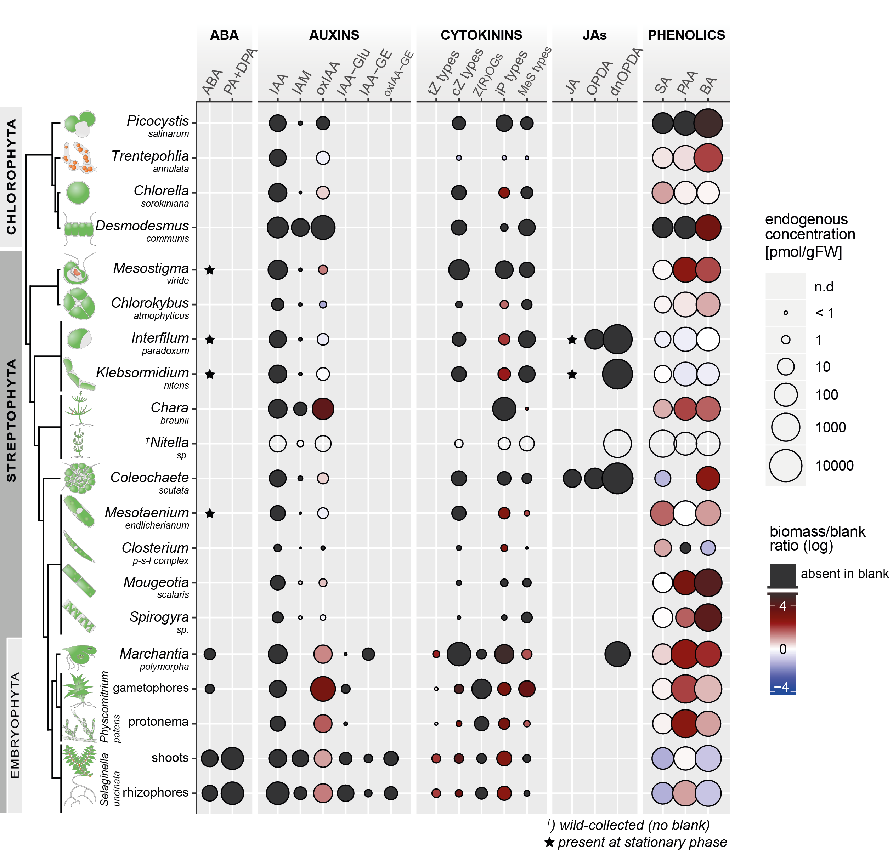
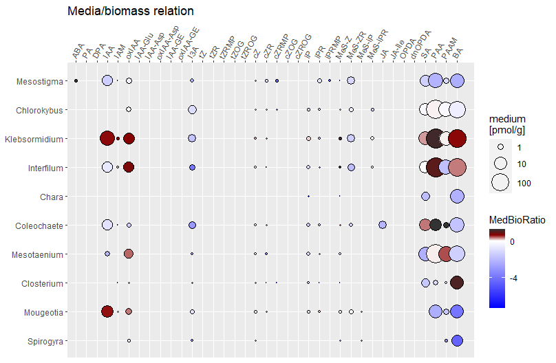
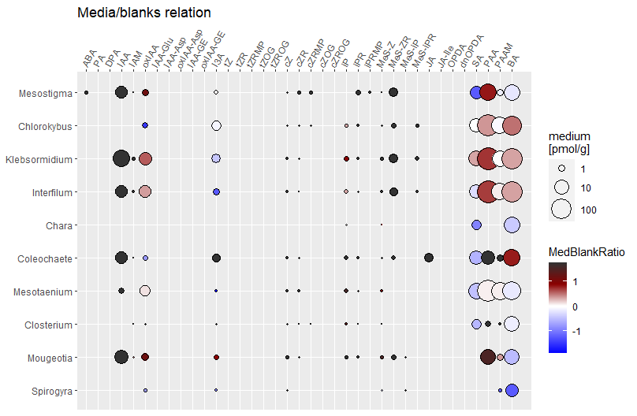

# BubblePlots-for-phytohormones
 R workflow for comprehensive visualization of analytical data using tidyverse and ggplot
 
 authors: Vojtěch Schmidt, Stanislav Vosolsobě

```{r setup}
```



## Introduction

This R code workflow provides a comprehensive presentation of
phytohormone contents. It was initially designed to plot the data
obtained in our study 'Phytohormone profiling in an evolutionary
framework', where we analyzed the phytohormone profiles in streptophyte
green algae
(<https://www.biorxiv.org/content/10.1101/2023.04.06.534998v1.full>).

Of course, this R code workflow can also be adapted for the
comprehensive presentation of other types of analytical data. Its
ability to convey multiple types of information in a single plot makes
it a versatile tool for enhancing the interpretation of results obtained
by various types of analyses.

### Experimental setup

In our study, we strove to analyze the endogenous contents of
phytohormone compounds in representatives of several algal lineages.
However, algal culture media are often supplemented with organic
components of complex composition such as agar, soil extract, peptone,
etc. These components introduce a background that could
potentially interfere with the analysis of the tested organisms.

Therefore, in addition to analyzing endogenous content in the biomass,
we also investigated the corresponding culture media and control empty
media (without added biomass, **Figure 1**) to account for potential
compound excretion and environmental background. This approach provides
a more comprehensive understanding of the data and enhances the
interpretation of the results.


Hence, this workflow aims to **convey two types of information within a
single plot:**

1.  To show the levels of individual compounds measured in the biomass
    of the tested species.
2.  To relate the endogenous levels with levels measured in the
    corresponding empty control (blank) media, accounting for any
    potential environmental background.

## Loading packages

On top of standard, in-built functions we will utilize `dplyr` package
for effective dataset shaping, and `ggplot2` for data visualization.
These two are included within the well-known `tidyverse` collection of
data packages. To load the Excel dataset, we will use the `readxl`
package.

```R         
#INSTALLING PACKAGES
install.packages("tidyverse")
install.packages("readxl")
```

```R
#LOADING PACKAGES
library("tidyverse")
library("readxl")

```

## The dataset

For demonstration purposes, a reduced dataset with raw data is provided.
It includes concentrations measured in the **biomass** samples of
streptophyte algae and corresponding culture **media** and control
(**blank**) media.

```R
dataset <- read_excel("data/tutorial_dataset.xlsx",na="NA") 
```

## Data sorting

Having three sample categories (biomass, medium, and blank), we will
firstly make individual subsets.

```R
biomas <- subset(dataset,(type=="biomass"))
medium <- subset(dataset,(type=="medium"))  
blank <- subset(dataset,(type=="blank"))
```

Then, we will employ the `aggregate` function enabling us to calculate
the mean concentration of individual compounds for each species while
grouping them into a data frame. The first column with species names is
then converted to `rownames` and deleted subsequently, so the data frame
contains only values.

This is done separately for each subset created previously. Biomass, medium, and blank data now have separate data frames with identical dimensions, and we can later relate these types of samples to one
another.

```R
biomasm <- aggregate(biomas[,4:ncol(dataset)], list(biomas$species), mean, na.rm = T)
rownames(biomasm) <- biomasm[,1]
biomasm[,1] <- NULL

mediumm <- aggregate(medium[,4:ncol(dataset)], list(medium$species), mean, na.rm = T)
rownames(mediumm) <- mediumm[,1]
mediumm[,1] <- NULL

blankm <- aggregate(blank[,4:ncol(dataset)], list(blank$species), mean, na.rm = T) 
rownames(blankm) <- blankm[,1]
blankm[,1] <- NULL
```

To make these relations, we need to convert our three new data frames to matrices, which will allow us to perform calculations.

Within this conversion, we also need to have the values in a numeric format, otherwise the calculations would not work.

```R
biomasm_num <- apply(as.matrix.noquote(biomasm), 2, as.numeric)
mediumm_num <- apply(as.matrix.noquote(mediumm), 2, as.numeric)
blankm_num <- apply(as.matrix.noquote(blankm), 2, as.numeric)
class(biomasm_num)
```

Now we can calculate ratios between our three sample types, which will be later visualized on a color scale displaying the prevalence of individual compounds in two compared sample types.

We are mainly interested in the comparison of biomass and blank. A logarithmic ratio of these matrices is converted to a new matrix (`bio_blank`, as here). Similarly, we can mutually compare culture media with biomass (`med_bio`) or blanks (`med_blank`).

```R
bio_blank <- log(biomasm_num/blankm_num)
med_bio <- log(mediumm_num/biomasm_num)
med_blank <- log(mediumm_num/blankm_num)
```

However, these calculations will generate non-finite values (`NaN`) in case a compound is absent. Therefore, these values are selected and set to `NA`.

```R      
bio_blank[!is.finite(bio_blank)] <- NA
med_bio[!is.finite(med_bio)] <- NA
med_blank[!is.finite(med_blank)] <- NA
```


Now, we can convert matrices back do data frames including matrices with original values. Data frames with original values (*i.e.* `bio_abs`and `med_abs`) will be used to visualize individual concentrations as circle size.

Finally, `rownames` are set from the original data frames.

```R 
bio_blank <- as.data.frame(bio_blank) 
med_bio <- as.data.frame(med_bio) 
med_blank <- as.data.frame(med_blank)
bio_abs <- as.data.frame(biomasm_num) 
med_abs <- as.data.frame(mediumm_num)

rownames(bio_blank) <- rownames(biomasm) 
rownames(med_bio) <- rownames(biomasm) 
rownames(bio_abs) <- rownames(biomasm)
rownames(med_blank) <- rownames(biomasm)
```


## Color palettes

Given the range of ratios (even in log scale) we will define a new color palette using the `colorRampPalette` function. Basically, we create two separate ramps for negative and positive values ( from white towards blue and red, respectively). These two ramps then constitute a vector, which will be used later during data plotting. Each relation has its own palette.

NOTE: These palettes are customized for our data, generally you can skip this step and start by using a pre-defined color palette during the plotting of your data.

```R
rc1 <- colorRampPalette(colors = c("blue", "white"), space = "rgb")(20*abs(min(na.rm = T,bio_blank)))
rc2 <- colorRampPalette(colors = c("white", "darkred", "grey20"), space = "rgb")(20*max(na.rm = T,bio_blank))
rampcols_bio_blank <- c(rc1, rc2)

rc1 <- colorRampPalette(colors = c("blue", "white"), space = "rgb")(20*abs(min(na.rm = T,med_bio)))
rc2 <- colorRampPalette(colors = c("white", "darkred", "grey20"), space = "rgb")(20*max(na.rm = T,med_bio))
rampcols_med_bio <- c(rc1, rc2)

rc1 <- colorRampPalette(colors = c("blue", "white"), space = "rgb")(20*abs(min(na.rm = T,med_blank)))
rc2 <- colorRampPalette(colors = c("white", "darkred", "grey20"), space = "rgb")(20*max(na.rm = T,med_blank))
rampcols_med_blank <- c(rc1, rc2)
```


## Generating plots

To define the order of species for the y-axis of the plot, we will create a vector of species names based on their phylogenetic relation. The order will be reversed so that early diverging species appear at the top of the plot.

```R
names <- c("Mesostigma","Chlorokybus","Klebsormidium","Interfilum","Chara","Coleochaete",
                 "Mesotaenium","Closterium","Mougeotia","Spirogyra")
rev_names <- rev(names)
```


Now, we will take `bio_abs` and `bio_blank` data frames and transform them to a long format using the `dplyr` pipeline (`%>%`) and `gather` function. These data frame will be used to plot the data.

```R 
df0 <-bio_abs %>%
  rownames_to_column(var = "id") %>%
  gather(key, conc, -id)

df1 <- bio_blank %>%
  rownames_to_column(var = "id") %>%
  gather(key, BioBlankRatio, -id)

head(df0)
head(df1)
``` 

Now, the main magic happens within few lines of code as follows:

1. We select the data (either df0, or df1; they both have same dimensions), then define the axes (x = key (*i.e.* compounds); y = id (*i.e.* species)), and finally define a plot type. Here we will prepare a scatterplot (`geom_point`) with point size determined by `df0` (*i.e.* concentration) and fill determined by `df1` (*i.e* biomass-to-blank ratio).

2. We employ the `scale_fill_gradientn` command, which creates an n-color gradient based on previously defined color ramp (`rampcols_bio_blank`). We also set color for NAs (which indicate the absence in blank).

3. We set the scale for point size. Here we use `pseudo_log` transformation with legend breaks covering the concentration range. This scale works well for our data, but you have to to fine-tune it for your data.

Finally, there are some adjustments of axes, such as positioning of x at the top, applying the `names` vector for the desired order of species (otherwise they would be ordered alphabetically), or setting an angle for the compound labels.

```R
bio_blank_plot <- ggplot(df0, aes(key, id)) +
                         geom_point(aes(size = df0$conc, fill = df1$BioBlankRatio,), shape = 21) +
  
  # Color gradient
  scale_fill_gradientn(colours = rampcols_bio_blank,
                       na.value = "grey20", 
                       name = "log(biomass/blank)") +
  
  # Point size scale
  scale_size(name = "Endogenous \nconcentration \n[pmol/gFW]",
             trans = "pseudo_log",
             breaks = c(0.1, 1, 10, 100, 1000, 10000),
             labels = c("< 1", 1, 10, 100, 1000, 10000),
             range = c(0.01, 10)
  ) +
  
  # Axes labels and positioning
  scale_x_discrete(limits = df0$key, expand = c(0.02, 0), position = "top") +
  scale_y_discrete(limits = rev_names) +
  
  # Theme customization
  theme(axis.text.x = element_text(hjust = 0.05, vjust = 0, angle = 60),
        axis.title.x = element_blank(),
        axis.title.y = element_blank()) +
  ggtitle("Biomass/blank relation")

bio_blank_plot
```


In the same fashion, we can generate a plot for culture media and their relation to blank media. You can use the `%>%` (pipe) symbol to save yourself a few lines of code and couple the plot generation with the transforming to long tables:

```R 
# MEDIA PLOTS ----
df2 <- med_abs %>%
  rownames_to_column(var = "id") %>%
  gather(key, Ratio, -id)


df3 <- med_bio %>%
  rownames_to_column(var = "id") %>%
  gather(key, MedBioRatio, -id) %>%
  ggplot(aes(key, id)) +
  geom_point(aes(size = df2$Ratio, fill = MedBioRatio ), shape = 21) +
  scale_fill_gradientn(colours = rampcols_med_bio, na.value = "grey20",breaks = c(-4,0,4)) +
  scale_size(name = "medium \n[pmol/g]",
             trans = "pseudo_log",
             breaks = c(0, 1, 10, 100, 1000, 10000),
             labels = c("< 1", 1, 10, 100, 1000, 10000),
             range = c(0.1,10)
  )+
  scale_x_discrete(limits=df0$key, expand = c(0.02, 0), position = "top") +
  scale_y_discrete(limits= rev_names) +
  theme(axis.text.x = element_text(hjust = 0.05, vjust = 0, angle = 60), axis.title.x = element_blank(),
        axis.title.y = element_blank())+
  ggtitle("Media/biomass relation")
df3



df4 <- med_blank %>%
  rownames_to_column(var = "id") %>%
  gather(key, MedBlankRatio, -id) %>%
  ggplot(aes(key, id)) +
  geom_point(aes(size = df2$Ratio, fill = MedBlankRatio ), shape = 21) +
  #scale_fill_gradient2(name = "log(biomass/medium)", high = "brown",, mid = "white", low = "blue")+
  scale_fill_gradientn(colours = rampcols_med_blank, na.value = "grey20") +
  scale_size(name = "medium \n[pmol/g]",
             trans = "pseudo_log",
             breaks = c(0, 1, 10, 100, 1000, 10000),
             labels = c("< 1", 1, 10, 100, 1000, 10000),
             range = c(0.1,10)
  )+
  scale_x_discrete(limits=df0$key, expand = c(0.02, 0), position = "top") +
  scale_y_discrete(limits= rev_names) +
  theme(axis.text.x = element_text(hjust = 0.05, vjust = 0, angle = 60), axis.title.x = element_blank(),
        axis.title.y = element_blank())+
  ggtitle("Media/blanks relation")
df4
```


And this is pretty much it! Once you've exported the plots, you can make some final tweaks in Illustrator or any other graphical editor to suit your personal preferences, but it's not necessary.

## Conclusion

It is important to note that this script was written by a PhD student in plant biology, not by a crackerjack coder. :) As a result, it may not be perfect, but it effectively generates a scatterplot that visualizes the relationship between the concentration of compounds and sample-to-blank ratio for each species. Although this approach works well for our data, it may require further fine-tuning to fit your specific needs. We encourage you to experiment and adjust the code to best suit your data and research questions.


